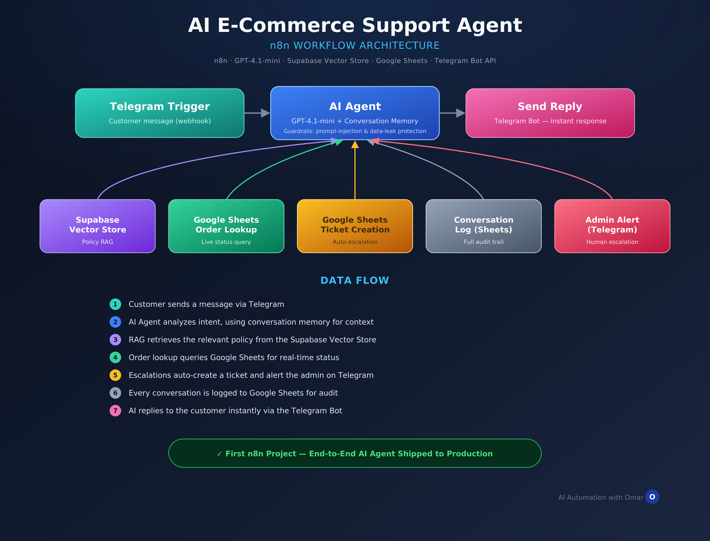

# AI E-Commerce Support Agent

> An AI-powered customer support agent built on **n8n** that handles e-commerce inquiries end-to-end via Telegram — 24/7, with zero manual triage.


**Built by:** [Omar Mohamed](https://www.linkedin.com/in/omar-mohamed-267361418/) — AI Automation Specialist
**Platform:** n8n · **AI Model:** OpenAI GPT-4.1-mini
📖 Full write-up: [CASE_STUDY.md](./CASE_STUDY.md)

---

## What it does

Customers message a Telegram bot with a question, an order number, or a complaint. The agent:

- Answers policy questions (shipping, returns, payments) using **RAG over Supabase Vector Store** — grounded in real company docs, not guesses
- Looks up **live order status** from Google Sheets
- **Auto-escalates** complaints into a ticket and pings the admin on Telegram
- Keeps a **full audit log** of every conversation
- Remembers context across a chat for natural multi-turn conversations
- Runs behind **security guardrails** against prompt injection and data leakage

## Why it exists

Manual support for a growing e-commerce store meant 30–60 minute response times, inconsistent policy answers, and complaints slipping through the cracks. This agent was built to close that gap without hiring a 24/7 support team.

| Metric | Before | After |
|---|---|---|
| Response time | 30–60 min | 5–10 seconds |
| Policy answer accuracy | Inconsistent | RAG-grounded |
| Missed complaints | Common | Auto-escalated |
| Support hours | Business hours | 24/7 |

## Architecture

```
Customer (Telegram)
    ↓
Telegram Trigger (Webhook)
    ↓
AI Agent (GPT-4.1-mini + Memory)
    ├──→ Supabase Vector Store — Policy lookup (RAG)
    ├──→ Google Sheets — Order status query
    ├──→ Google Sheets — Ticket creation (escalations)
    ├──→ Google Sheets — Conversation logging
    └──→ Telegram Bot — Admin alert (if escalated)
    ↓
Send Reply (Telegram Bot)
```

## Tech stack

- **n8n** — workflow orchestration
- **OpenAI GPT-4.1-mini** — the agent's reasoning model
- **OpenAI Embeddings** (`text-embedding-3-small`) — vector generation for RAG
- **Supabase** — vector database for RAG
- **Google Sheets** — order data, tickets, conversation logs
- **Telegram Bot API** — customer interface + admin alerts

## Getting started

### Prerequisites

- A running [n8n](https://n8n.io) instance (self-hosted or cloud)
- An OpenAI API key
- A Supabase project with the [vector extension](https://supabase.com/docs/guides/ai) enabled
- A Google account with Sheets API access
- A Telegram bot token ([via @BotFather](https://core.telegram.org/bots#botfather))

### Setup

1. Clone this repo:
   ```bash
   git clone https://github.com/omareldakhly/ai-ecommerce-support-agent.git
   ```
2. Import the workflow JSON into your n8n instance (`Workflows → Import from File`)
3. Add credentials in n8n for: OpenAI, Supabase, Google Sheets, Telegram
4. Set the following environment variables / credential fields:
   - `OPENAI_API_KEY`
   - `SUPABASE_URL` / `SUPABASE_KEY`
   - `TELEGRAM_BOT_TOKEN`
   - Google Sheets document ID(s) for orders, tickets, and logs
5. Load your store's policy documents into the Supabase Vector Store (shipping, returns, payment policy text)
6. Activate the workflow and message your bot to test

## Security

- System prompt includes explicit guardrails against prompt injection, system-prompt extraction, bulk data requests, and policy-override attempts
- All data access is tool-mediated — the AI never queries data it wasn't given a tool for
- Error branches catch API failures with fallback messages and retry logic

## Roadmap

- [ ] Voice message support (Whisper transcription)
- [ ] Multi-language support (Arabic + English)
- [ ] Shopify / WooCommerce integration for live inventory
- [ ] Sentiment analysis for proactive escalation
- [ ] Admin dashboard for the ticket queue

## Connect

- **LinkedIn:** [Omar Mohamed](https://www.linkedin.com/in/omar-mohamed-267361418/)
- **GitHub:** [omareldakhly](https://github.com/omareldakhly)
- **Email:** omareldakhly20@gmail.com

---

*Built with n8n, OpenAI, and a lot of coffee ☕*
